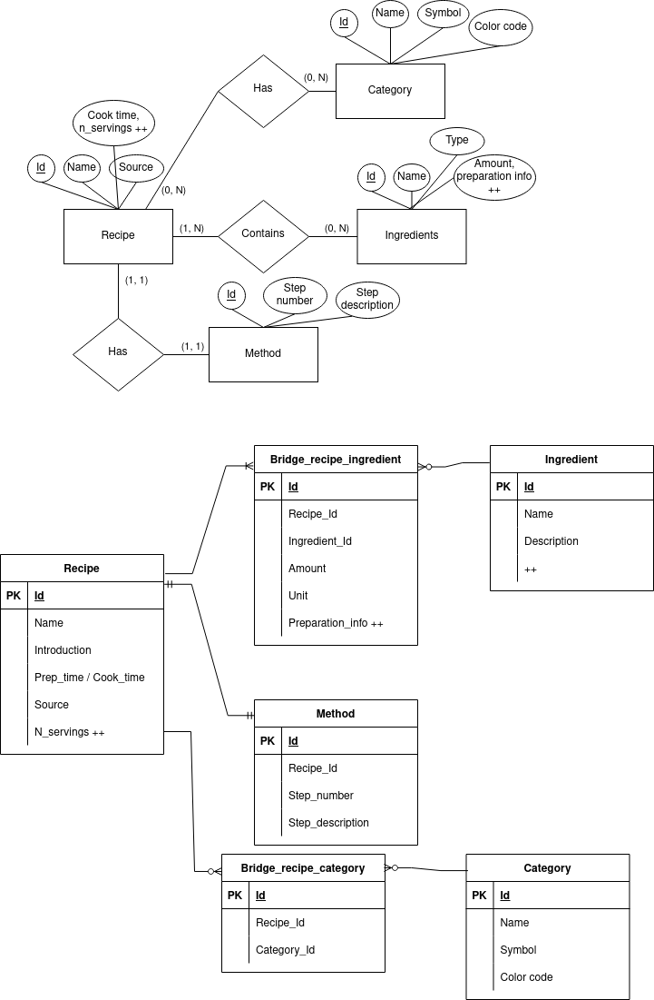

# recipe-db
API for managing food recipes, using [FastAPI](https://fastapi.tiangolo.com/) and [SQLite](https://www.sqlite.org/).

## Database model


## Project setup

First install [Poetry](https://python-poetry.org/docs/#installation), then install the defined dependencies:

```
$ poetry install
```

Make sure SQLite is also installed, then create tables and insert some dummy data:
```
$ cat sql/create_tables.sql | sqlite3 food.db
$ cat sql/insert_data.sql | sqlite3 food.db
```

Start server:

```
$ uvicorn main:app --reload
```

## Usage
After having started the server, see http://127.0.0.1:8000/docs for the API documentation.
